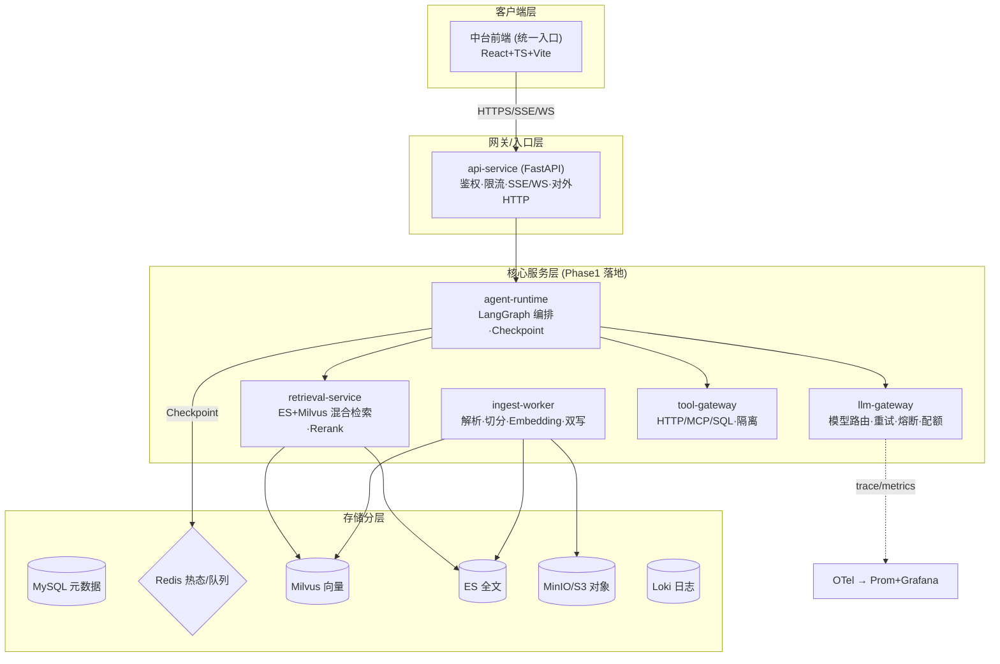
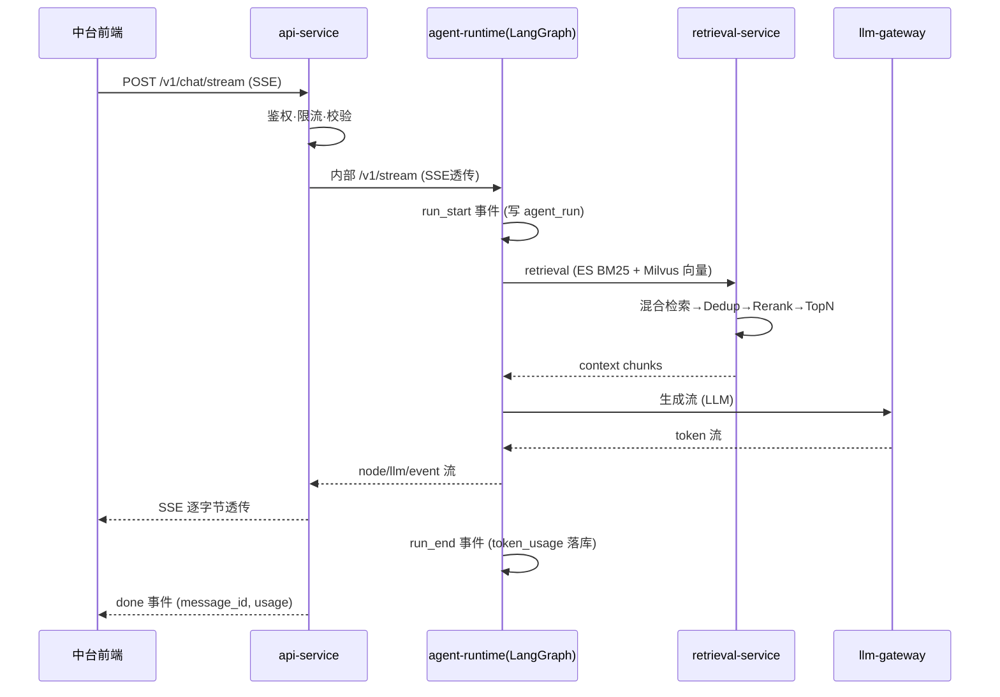

# ADR · SUIG-29 高性能智能体中台 V1.0 落地分析 · 对比既有系统与工程改造规划

> 状态：**设计 / 规划阶段**（未实施）。本文档为架构评审 + ADR 决策基线，供后续分任务落地引用。
> 评审人：随架构（architect）｜ 日期：2026-09-27 ｜ 依据：SUIG-29 用户方案原文（V1.0）+ 既有 `agent-platform/` 代码证据 + 既有增量文档（SUIG-10/15/16/17/18/21）
> 结论：**采纳 V1.0 方案为演进目标，但不推翻既有 monolith 骨架，采用「演进式微服务拆分」**，分 Phase 落地。

---

## 1. 背景与任务范围

用户提供了《高性能智能体中台真实落地实施方案》V1.0（生产可落地、分阶段），要求：

1. 评审该 V1.0 落地方案；
2. 与既有（之前）系统对比异同 / 优劣势 / 差异点；
3. 基于 V1.0 优化改造既有系统；
4. 设计统一的中台前端；
5. 整合为完整可运行平台；
6. 用 ylk-adr 工作流跨仓分析整个工程改造，沉淀 ADR；
7. 拆分为分任务执行计划并逐一落地。

**输入材料与既有事实**：

- 方案原文（V1.0）：微服务首次期核心服务 = `api-service`、`agent-runtime`、`retrieval-service`、`ingest-worker`、`llm-gateway`、`tool-gateway` 六个；数据分层 MySQL/Redis/ES/Milvus/MinIO/MQ/Loki；RAG Query→ES BM25+Milvus Vector→Merge→Dedup→Rerank→TopN→LLM；Agent Unified Run Model + 统一事件；LLM Gateway / Tool Gateway；多租户；高可用；OTel 监控；21 张首期表；分三阶段（MVP→生产化→平台化）；Phase1 SLA。
- 既有系统：`agent-platform/`（随工作室知识库内），经 SUIG-10/15/16/17/18/21 六段增量落地，当前是 **FastAPI monolith 网关 + langgraph_service + ingest 三段式进程**，账目 6 张业务表，OTel/指标/容器/K8s 已具备，Embedding/LLM 处于 echo 桩阶段（未接真实模型）。

**本次交付**（本 ADR 覆盖）：
- §2 对比矩阵（既有 vs V1.0）
- §3 差异点 / 优劣势
- §4 优化改造方向（gap→改造）
- §5 中台前端设计
- §6 分任务执行计划
- §7 风险与验收标准
- 后续分任务各自立项推进（本项目仅保留 ADR 文档冰点，即随授权实施）

---

## 2. 既有系统 vs V1.0 方案对比矩阵

| 维度 | 既有 `agent-platform`（SUIG-10/15-18/21 累计） | V1.0 方案（目标） | 差异判断 |
|---|---|---|---|
| 服务边界 | **三段式 monolith-lite**：`api` 网关（对外）+ `langgraph_service`（编排）+ `ingest`（摄入 worker）；**未拆检索/LLM/工具** | 六独立微服务：api-service / agent-runtime / retrieval-service / ingest-worker / llm-gateway / tool-gateway | **差异核心**：V1.0 切得更细，强调独立水平扩展；既有单 api 网关承载 agent/模型管理 |
| 对外技术栈 | FastAPI + Uvicorn + 全异步；JWT + api_key 哈希轮换；SSE 逐字节透传 | FastAPI + 全异步 + SSE/WS + 多租户 JWT | 大体一致；既有缺 WebSocket、缺多租户 |
| 数据模型 | **6 张表**：`user`/`knowledge_base`/`document`/`conversation`/`message`/`agent_config` | **21 张表**：sys_tenant/sys_user/sys_role/sys_permission/agent/agent_version/agent_tool/agent_knowledge/knowledge_base/document/document_chunk/conversation/message/model/model_provider/tool/tool_permission/task/agent_run/agent_event/audit_log | **差异**：既有缺 租户/角色/权限/版本/工具/模型/运行审计/事件/日志 等多表；V1 表更全 |
| 数据分层 | 已分层：MySQL(元)+Redis(热)+Milvus(向量)+ES(全文)+本地磁盘/MinIO(原文件) | 同分层 + MinIO/S3 统一对象存储 + Loki 日志 | **基本一致**；既有原文件落本地盘缺 MinIO/S3、缺 Loki 日志库 |
| RAG 链路 | `_stub_embed` + fuse_dedup + rerank_chunks + text_hydrate + retrieval_cache（echo 桩向量） | Query Rewrite → ES BM25 + Milvus Vector → Merge → Dedup → Rerank → Context Top-N → LLM | **一致方向**；既有已实现融合/去重/重排/Cache 骨架，但 Embedding 为 echo 桩、无 Query Rewrite、无独立检索服务 |
| LLM 接入 | `llm/client.py` OpenAICompatProvider + EchoProvider + CircuitBreaker + retry + fallback | 独立 `llm-gateway`：统一模型路由/Key/超时/重试/熔断/Fallback/Token/配额/审计 | **既有已在编排进程内实现重试/熔断**，V 更强调独立网关 + 配额/审计 |
| 工具接入 | **几乎无**（`agent_tool` 表存在但 tool 执行未实现） | 独立 `tool-gateway`：HTTP/MCP/SQL 统一访问 + 鉴权/校验/隔离 | **重大缺口** |
| Agent 运行模型 | LangGraph RAG 单图 + RedisSaver Checkpoint + run/事件 | Unified Run 模型（run_id/trace_id/status/token_usage）+ 统一事件总线（run_start→run_end） | 既有已具 run 骨架，缺**标准字段/事件契约**与 **trace_id/agent_version** 对齐 |
| 文档摄入 | 完整：parser/切分/tokenizer/embedding/双写补偿/状态机/UPLOADED→…→READY | 同思路：File→MinIO→MQ→Parser→Chunk→Embedding→Milvus+ES→MySQL READY | **一致**；既有用 arq(Redis 队列) 代替 MQ，用本地盘代替 MinIO |
| 多租户/权限 | 单用户 owner 归属校验（`require_kb_access`） | Multi-tenant：Tenant→User→Role→Permission；全业务对象带 tenant_id | **重大缺口**：需引入租户层与 RBAC |
| 可观测 | OTel → 内存/OTLP + Prometheus `/metrics` + Grafana 面板 + 5 条告警；`kb_` 指标齐全 | 统一 OTel → Trace/Metrics/Logs → Prom + Grafana + Loki/ES | **一致**；缺 Loki/ES 日志接入 |
| 部署 | Dockerfile ×3 + K8s manifest + HPA + Compose 六服务；镜像构建未跑（无 daemon） | 高可用 ≥2 实例 + Redis/MySQL/Milvus/ES/MinIO 集群化 | 大体一致，需按规模扩实例与集群 |
| 管理/统一入口 | 无前端 | 统一中台前端（管理中台 Agent/知识库/模型/工具/监控） | **缺口**：无 UI |

---

## 3. 优 / 劣势与差异点结论

**既有系统优势（可平移，勿推翻）**：
- I. 骨架、存储层客户端、健康探活、双写补偿状态机、RAG 去重/重排序、LLM client 重试/熔断、SSE 透传、鉴权/JWT、OTel/指标/告警、容器/K8s/HPA 均已真实实现并通过冒烟门禁。
- II. monolith-lite 演进成本低，单进程即可端到端跑通，符合"先闭环再平台化"的既定原则（对标 V1.0 "核心闭环优先"）。

**既有劣势（需 V1.0 补全）**：
- III. 无多租户 / RBAC、无 Agent 版本、无模型/工具管理、无 agent_run/event 统一标准、无审计日志。
- IV. 无独立 LLM/Tool 网关 → 配额、多模型统一路由、SQL/代码执行隔离等都缺。
- V. 无前端统一入口；无 Query Rewrite；无 MinIO 统一对象层、无任务粗粒度（MapReduce 无）。
- VI. Embedding / LLM 均为 **echo 桩**——真实模型未接入，是"**看着能跑、实际无业务价值**"的最大断层。

**V1.0 的优势**：服务解耦可独立扩容、统一 Run/trace、LLM/Tool 网关化、多租户、21 表域模型完整、内置监控与 SLA。

**V1.0 的劣势 / 需裁剪**：首期即 6 服务会让"开发/部署/排障"复杂度陡增（对单团队早期是负担）、表偏宽（21 → 可合并）、集群化/Queue/MCP/Marketplace 超出 MVP 需求。

**差异结论**：既有系统是"**单体化的垂直切片 + 观测型成熟**"；V1.0 是"**分布式水平扩展 + 平台型**"。两者不在同一成熟度，但**同一条技术主干（FastAPI+LangGraph+四类存储+RAG+SSE）连续**——因此**增量演进，不推倒重来**。

---

## 4. 工程改造方向（分阶段优化既有系统）

原则：**不推倒既有价值**，在既有 `agent-platform` 基础上按 V1.0 目标做"功能补全 + 边界演进"，分 Phase 收敛：

- **Phase 0 · 真实模型接通（最高优先）**：把 echo 桩替换为真实 Embedding / LLM（OpenAI 兼容 / 境内 API）。破"看着能跑"断层。→ 落地 `ingest/embedding.py`、`langgraph_service/llm/providers.py`。
- **Phase 1.1 · 域模型与服务化**：按 V1.0 21 表收敛既有 6 表，补齐 `sys_tenant/agent_version/agent_tool/agent_knowledge/document_chunk/model/model_provider/tool/agent_run/agent_event/audit_log`；目录收敛 = `api-service`(现今 api) / `agent-runtime`(现 langgraph_service) / `retrieval-service`(新建独立检索) / 现有 ingest-worker。
- **Phase 1.2 · LLM / Tool 网关化**：把既有 `llm_client` 提升为独立 `llm-gateway`（补配额/多模型路由/audit）；新建 `tool-gateway`（HTTP/MCP/SQL，最小权限 + 隔离）。
- **Phase 2 · 多租户与 RBAC**：`tenant_id` 全对象贯标 + Role/Permission 后端，与既有 `require_kb_access` 合并为 `rbac` 统一准入。
- **Phase 3 · 对象存储与日志**：落盘改 MinIO/S3；加 Loki/OTLP 日志仓库。
- **Phase 4 · 中台前端**：`ly 统一管理入口`（见 §5）。
- QA / 契约 / 冒烟 / E2E：每个 Phase 配门禁（逻辑下设验证 + 接真实栈）。

---

## 5. 中台前端设计（统一入口）

- **技术选型**：React + TypeScript + Vite + Tailwind；状态管理 Zustand；请求 TanStack Query；图表 Recharts；SSE 用 `fetch` 流式读取（配 `ReadableStream`）；WS 用原生/`socket.io`。
- **布局**：左侧导航（Agent 管理 / 知识库 RAG / 模型配置 / 工具/MCP / 会话工作台 / 监控 / 用户权限 / 系统设置）+ 顶部租户切换 + 眼观.
- **核心页面**：
  1. **工作台（总览）**：在线会话、运行数、成功率、Token 用量、检索命中率、缓存命中率。
  2. **Agent 管理**：Agent 创建 / 配置（prompt / 模型 / 工具绑定）/ 版本 / 发布 / 运行监控。
  3. **知识库 RAG**：库 CRUD、文档上传（202 轮询 status）、分词预览、混合检索调试（TopK/重排阈值）。
  4. **对话工作台**：SSE 流式、RAG 引用标注、工具调用可查看、LLM 用量。
  5. **工具/MCP 网关**：工具列表、授权、调用记录。
  6. **监控**：Grafana 内嵌或指标面板（缓存命中/检索 P99/错误率）。
  7. **用户/租户/权限**：RBAC 管理（Phase 2+）。
- **后端聚合**：前端直连 `api-service`（对外）；SSE `/v1/chat/stream`、WS `/v1/stream` 原生透传；监控走 `/metrics` + Grafana 代理。

---

## 6. 分任务执行计划（SAM 域概览）

按 ylk-adr 第 7 步"分任务执行"，凭授权逐项派发给随研发 / 随测试 / 随设计。（细化到字段与验收点见下节 ADR + 排程 issue。）

| 计划 | 任务 | 验收文档 | 状态 |
|---|---|---|---|
| P0 | 接通真实 Embedding / LLM（替换 echo 桩） | 供给 / 冒烟实测真实向量 + 真实对话 | 设计（待授权） |
| P1.1 | 域模型收敛 V1.0（6→21 表 + migration） | 域模型 / 迁移脚本 / 契约对齐 | 设计 |
| P1.2 | 检索服务 extracting `retrieval-service` | 检索契约 / 独立服务 / 压测 | 设计 |
| P1.3 | LLM 网关化 + Tool 网关（含 SQL 隔离） | 网关 API + 审计 + 最小权限 | 设计 |
| P2 | 多租户 + RBAC 接入 | RBAC 契约 / 越权回归 | 设计 |
| P3 | MinIO 落盘 + Loki 日志 | MinIO / OTLP 埋点 | 设计 |
| P4 | 中台前端（整套 UI 统一入口） | 前端仓库 + E2E 验收 | 设计 |
| QA/测试 | 每 Phase 门禁（单测 + 冒烟 + E2E） | 冒烟/E2E 报告 | 设计 |

---

## 7. 风险、边界与未决项

- **主要风险**：全局 6 服务拆分过早导致开发/排障成本上升；真实模型接入与 Key/授权未授权；MinIO/MQ/Loki 新增组件引入新依赖；前端是一次全新从未做过的大块投入。
- **边界**：V1.0 已明确"**不**做"自研向量库/推理/队列/K8s/复杂 Marketplace/拖拽 Design/RAG 评估/大规模多模态等——Aligned，遵守。
- **未决项（需 owner / PM 定）**：首期真实实例规模与模型选型；租户隔离强度（字段级 vs 库级）；工具 SQL/代码执行隔离落地细则；前端 UI 视觉基线（随设计可出）。

---

## 8. 交付状态

- [x] ADR 评审文档本件（对比 + 优劣势 + 改造方向 + 前端设计 + 分任务计划 + 风险 + 架构图 + 时序图）——**评审稿完成**。
- [x] （2026-09-29）owner 随祥熙已授权："按照规划进行优化，并分配任务到指定的人员，继续推进任务" → 进入派发阶段。
- [ ] 分任务派发与实施（Phase 0-4）——已据此创建名下子任务并指派给对应角色，实施状态在各子任务 issue 跟踪。

> 本件为架构评审 ADR（冰点）。分任务细化、实施与验证将由后续独立任务 / 子任务承载，ADRs 在此收敛为稳定的决策基线；实施状态在对应 issue 跟踪。

---

## 9. 架构图（目标拓扑 · Phase 演进收敛）

## 10. 核心时序图（对话 + RAG 在线链路）

